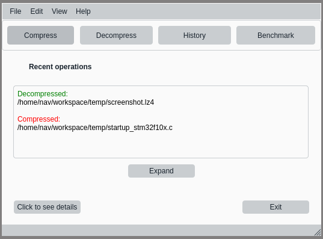
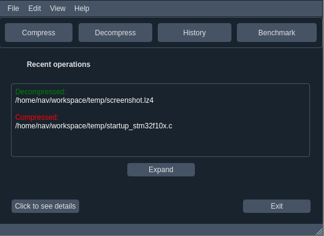
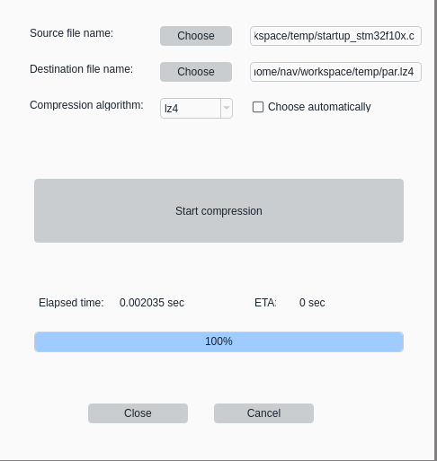
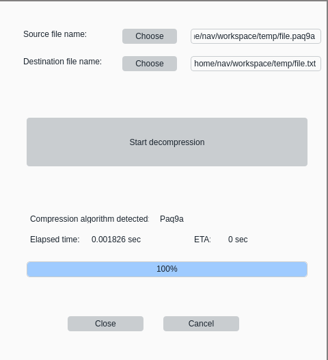
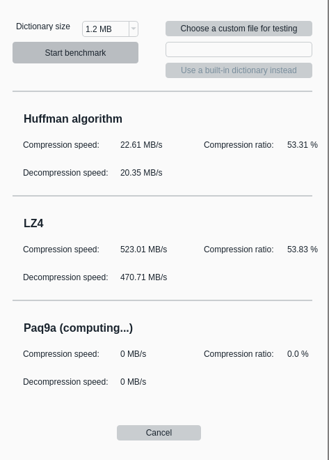
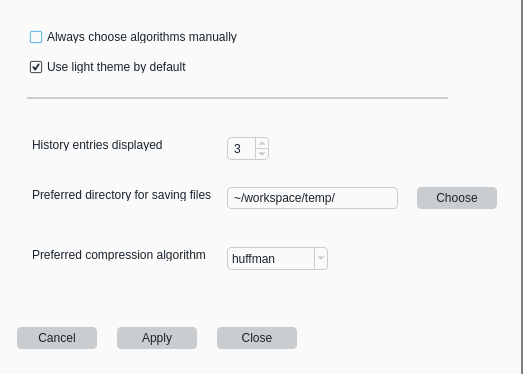
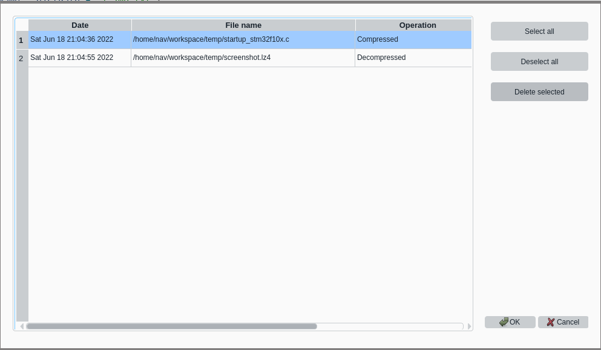

A fork of [par](https://github.com/sekvanto/par). mfpar - Multiple Data Formats Pocket Archiver. Also, this version has Qt UI and is written partially in C and partially in C++.

It's a simple data compression program, which supports a set of compression algorithms:

* Huffman coding
* LZ4
* Paq9a

This is how the main window looks like:

Dark mode is also available:

The main window displays buttons for operations such as compression, decompression, benchmark, preferences, history edit and it displays operations history as well, which is sortable by date or name, can be expanded and collapsed.

Here is the example of compression:

Here is the example of decompression:

Benchmark:

Preferences:

Preferences are stored in Qt .ini config file, and it's possible to set defaults for such options as light/dark theme, history entries displayed, preferred compression algorithm etc.

History edit:

History is stored in MySQL database. It's possible to remove some of the entries or clear the whole history of operations.

MfPar has several dependencies, including:
1. Linux environment. The program will be ported to other platforms later, but now several aspects are tied to Linux.
2. [par](https://github.com/sekvanto/par)
3. lz4
4. [paq9a](https://www.cyberforum.ru/blogs/742519/blog4971.html)
5. mysql, mysql c++ connector
6. Qt
